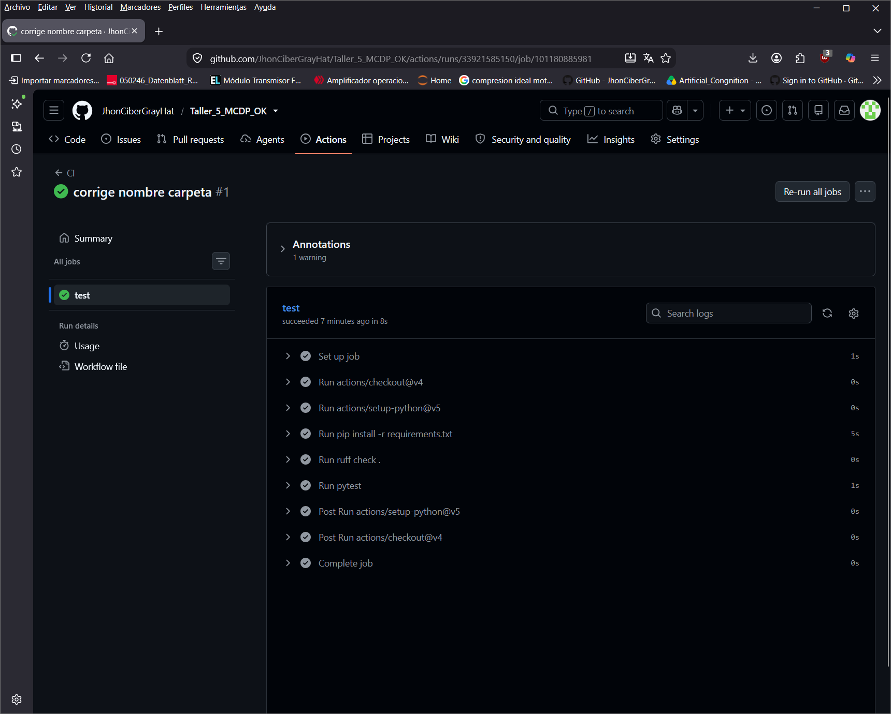
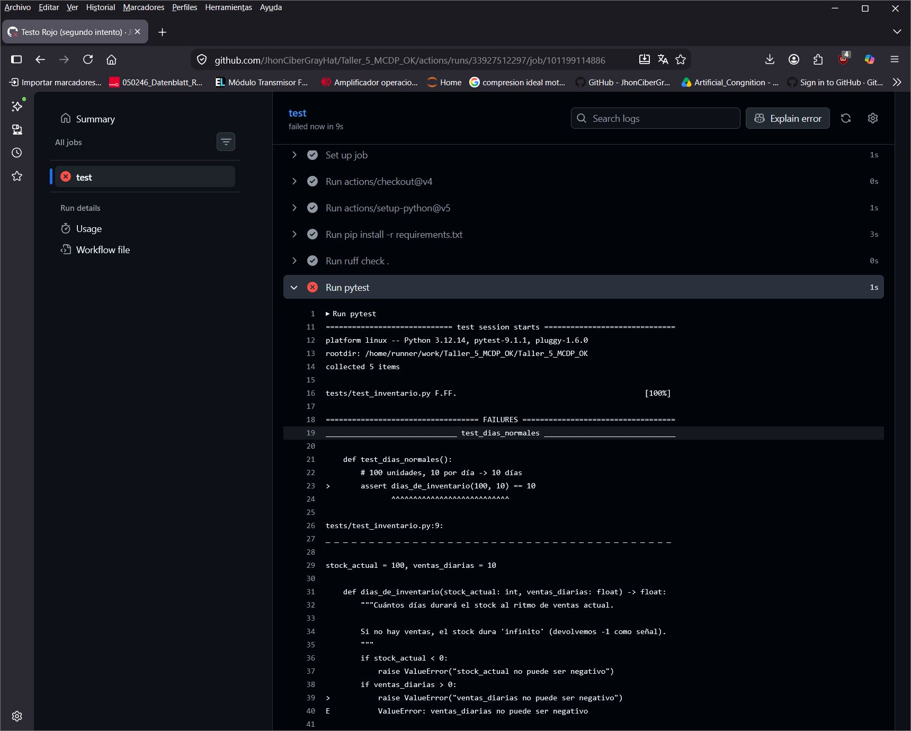
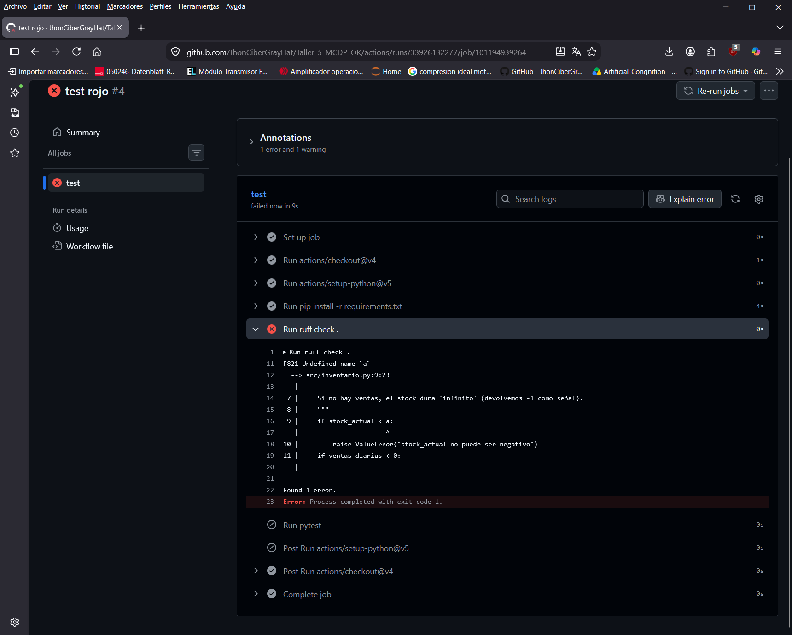
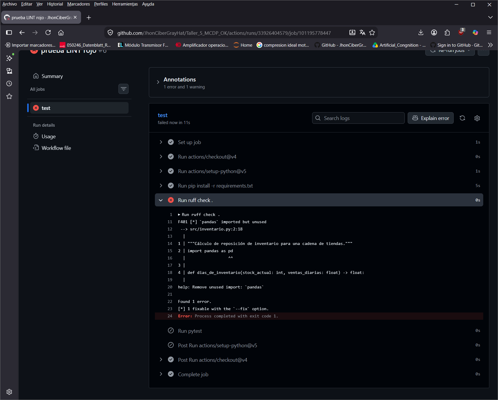
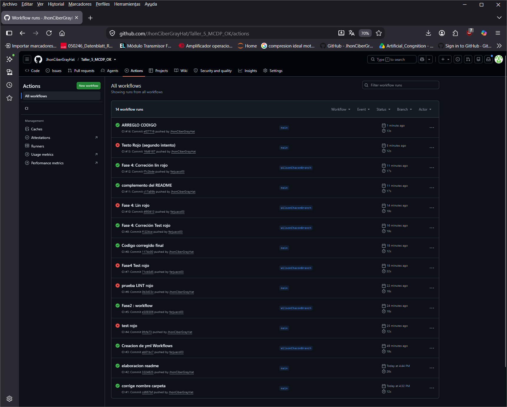

# Taller Semana 5 — El pipeline que nunca se escribió 🤖

## Ejecutado por

- Wilson Fernando Chacón
- Jason Contreras
- Jhon Henry Camacho


**Empieza leyendo [`ENUNCIADO_TALLER.md`](ENUNCIADO_TALLER.md).**

## Qué hay aquí
```
pipeline-ci-ml/
├── ENUNCIADO_TALLER.md   <- LÉEME PRIMERO
├── src/inventario.py     <- el código (funciona)
├── tests/test_inventario.py  <- 5 pruebas (pasan)
├── requirements.txt
└── .gitignore
```

Falta lo más importante, y es tu trabajo: **`.github/workflows/ci.yml`**.

## Arranque
```bash
python -m venv .venv
source .venv/bin/activate        # Windows: .venv\Scripts\Activate.ps1
pip install -r requirements.txt
ruff check .                     # All checks passed!
pytest                           # 5 passed
```

## Tu trabajo (resumen — el detalle está en el ENUNCIADO)
1. Corre el proyecto local y confirma que pasa.
2. Escribe `.github/workflows/ci.yml` (push/PR, ubuntu, checkout, python, install, ruff, pytest).
3. Súbelo a GitHub y velo ponerse verde en la pestaña Actions.
4. Rómpelo a propósito (un test y un lint) para ver el rojo, y arréglalo.
5. Documenta con capturas y trabaja con ≥5 commits.


## DESARROLLO DEL TALLER

FASE 1: CORRIENDO LOCAL

Se intala el entorno local y los requerimientos, posteriormente se corre RUFF CHECK y se comprueba que el mensaje es: All checks passed!
tambien se corre el pytest y se comprueba que pasaron los 5 test satisfactoriamente.

FASE 2: 

Se crean las carpetas y archivo .github/workflows/ci.yml, se escribe el codigo teniendo en cuenta las recomendaciones:      - Dispararse en cada `push` y cada `pull_request`.
                    - Correr en `ubuntu-latest`.

QUE HACE MI workflow:

    1. se Dispara en cada `push` y cada `pull_request`.
    2. Corre en `ubuntu-latest`.
    3. Trae el código (checkout) a la maquina.
    4. Instala  Python 
    5. Instala las dependencias (requirements.txt).
    6. Corre el linter (ruff) para verificar codigo innecesario como librerias o variables no usadas.
    7. Corre las pruebas (pytest) para detectar errores de logica de codigo.


FASE 3: 

Se verifica que el codigo corre en verde, en el github: 



FASE 4: 

Test rojo: 

Se modifica el condicional de VENTAS DIARIAS cambiando el < por un > para generar el error de codigo (división por ceo), se corre el pytest:



tambien se lanza el commit con el codigo erroneo con el siguiente resultado el github: 


Lint rojo:

Se importa a proposito la libreria pandas en inventario.py y se lanza el commit: 


Finalmente se arregla el codigo para que funcione y se lanza commir




