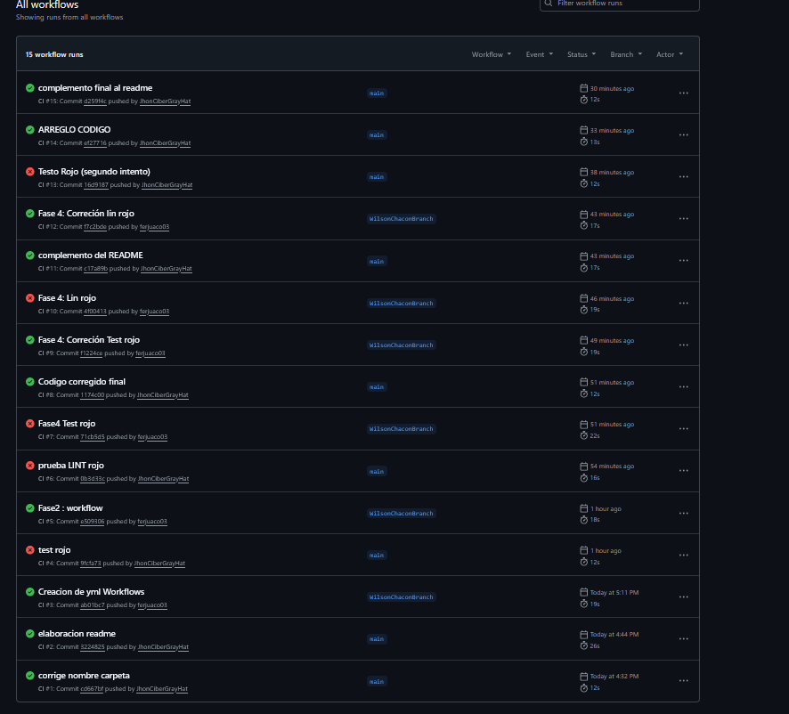
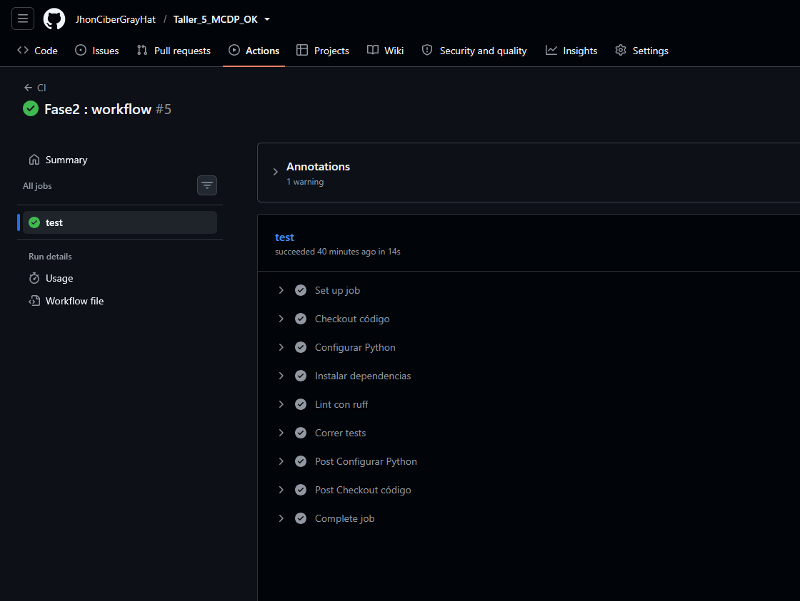
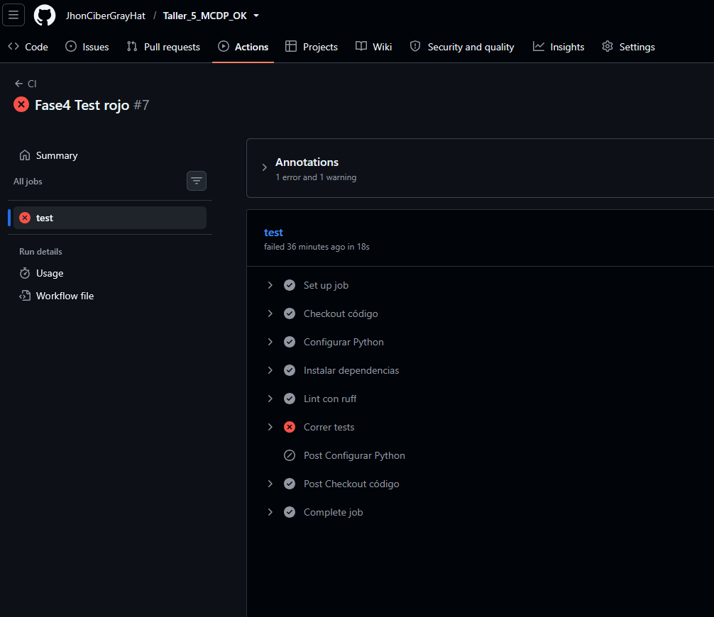
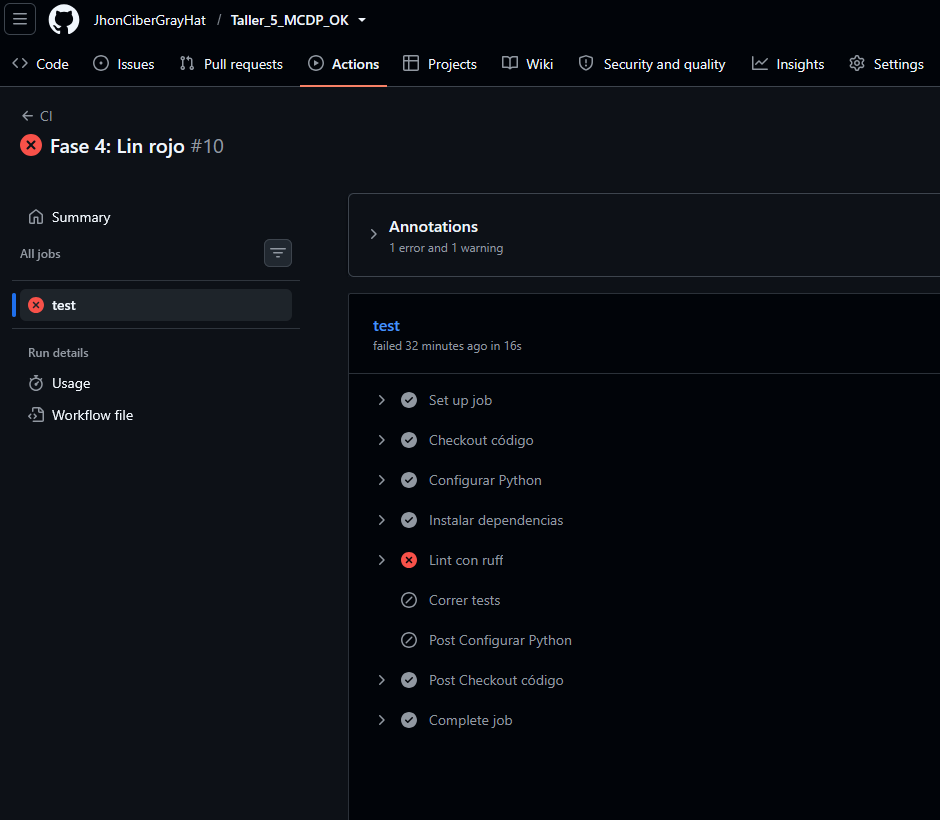

# Taller Semana 5 — El pipeline que nunca se escribió 🤖

## Ejecutado por

- Wilson Fernando Chacón
- Jason Contreras
- Jhon Henry Camacho

**Empieza leyendo [`ENUNCIADO_TALLER.md`](ENUNCIADO_TALLER.md).**

## Requisitos

Python 3.13.14 (versión con la que se probó y certificó este proyecto —
otras versiones 3.13.x probablemente funcionan, pero no fueron probadas).

## Estructura del proyecto

```
Taller_5_MCDP_OK/
├── .github/
│   └── workflows/
│       └── ci.yml              <- el workflow de CI (lo que había que crear)
├── src/
│   ├── __init__.py
│   └── inventario.py           <- el código de reposición de inventario
├── tests/
│   ├── __init__.py
│   └── test_inventario.py      <- 5 pruebas
├── ENUNCIADO_TALLER.md         <- LÉEME PRIMERO
├── README.md
└── requirements.txt
```

*(las carpetas `.pytest_cache/`, `.ruff_cache/` y `__pycache__/` son artefactos
generados automáticamente al correr `pytest` y `ruff`; no se versionan a mano.)*

## Arranque

```bash
python -m venv .venv
source .venv/bin/activate        # Windows: .venv\Scripts\Activate.ps1
python -m pip install --upgrade pip
pip install -r requirements.txt
ruff check .                     # All checks passed!
pytest                           # 5 passed
```

## Desarrollo del taller

### Fase 1 — Correr local

Se instaló el entorno virtual, se actualizó `pip` a la última versión
(`python -m pip install --upgrade pip`) y luego se instalaron las
dependencias del `requirements.txt`. Se corrió `ruff check .` y se
confirmó el mensaje `All checks passed!`, y luego `pytest`, confirmando
que los 5 tests pasaban sin ningún cambio en el código entregado. Todo
esto se probó sobre Python 3.13.14.

### Fase 2 — Escribir el workflow

Se creó la carpeta `.github/workflows/` y dentro el archivo `ci.yml`. El
workflow se dispara en cada `push` y cada `pull_request`, corre sobre
`ubuntu-latest`, y ejecuta los pasos en este orden:

1. **Checkout** (`actions/checkout@v4`) — trae el código del repositorio al
   runner. Sin este paso el runner arranca vacío y nada más funciona.
2. **Setup Python** (`actions/setup-python@v5`) — instala el intérprete de
   Python en el runner.
3. **Instalar dependencias** — `pip install -r requirements.txt`, el mismo
   comando que se corre en local.
4. **Lint** — `ruff check .`, revisa que el código esté limpio (sin
   imports sin usar, estilo, etc.).
5. **Tests** — `pytest`, corre las 5 pruebas contra el código.

Se probó el workflow subiéndolo por primera vez y verificando en la
pestaña **Actions** de GitHub que corriera de punta a punta en verde.

### Fase 3 — Verde en Actions

Con el `ci.yml` ya funcionando, cada push posterior dispara el pipeline
automáticamente y se pudo confirmar en Actions que los 5 tests pasaban y
el lint quedaba limpio, sin que nadie tuviera que correr nada a mano.

### Fase 4 — Romperlo a propósito (rojo por test y rojo por lint)

Se provocaron dos fallas distintas, cada una en su propio commit, para
comprobar que el pipeline realmente detecta el código roto:

**Rojo por test:** se cambió la operación de `dias_de_inventario` de
división (`/`) a suma (`+`), rompiendo el cálculo. Al hacer push, el
workflow falló en el paso `pytest` porque `test_dias_normales` esperaba
`10` y el resultado ya no coincidía. Se confirmó el rojo en Actions y
luego se corrigió la operación de vuelta a `/`.

**Rojo por lint:** se agregó un `import os` sin usar en `inventario.py`.
Al hacer push, el workflow pasó `pytest` sin problema pero falló en el
paso `ruff check .`, exactamente el paso esperado para este tipo de
error. Se confirmó el rojo en Actions y luego se retiró el import,
dejando el pipeline verde de nuevo.

## Historial de commits

| # | Commit | Rama | Qué se hizo |
|---|---|---|---|
| 1 | `08c2ebe` — Creación del repositorio y carga de archivo taller 5 | main | Se crea el repo y se sube el material base del taller (código, tests, enunciado). |
| 2 | `c96bee4` — Instalación entorno y pruebas locales | main | Se crea el entorno virtual, se instalan dependencias y se corren `ruff` y `pytest` en local, confirmando que todo pasa antes de tocar CI. |
| 3 | `15435ff` — Creación .yml | Jhon_camacho | Primera versión del `ci.yml`, escrita en una rama aparte. |
| 4 | `e6b6f00` — Merge pull request #1 from Jhon_camacho | main | Se mezcla el trabajo del `.yml` de vuelta a `main` vía Pull Request. |
| 5 | `f6fd458` — Ajuste .yml (ajuste de tipo) | main | Se corrige un detalle de sintaxis/tipo en el workflow. |
| 6 | `ed5e13d` — Readme ajustado | main | Se documenta el desarrollo de la Fase 1 en el README. |
| 7 | `8ddfa78` — Se crea branch y se prueba el proyecto | WilsonChaconBranch | Wilson crea su rama de trabajo y vuelve a correr tests y `ruff` en local sobre esa rama. |
| 8 | `ab01bc7` — Creación de yml Workflows | WilsonChaconBranch | Se crean las carpetas `.github/workflows/` y el archivo `ci.yml` en esta rama. |
| 9 | `e509306` — Fase 2: workflow | WilsonChaconBranch | Se prueba que el workflow corra correctamente al hacer push (primer verde). |
| 10 | `71cb5d5` — Fase 4: Test rojo | WilsonChaconBranch | Se cambia a propósito `/` por `+` en `dias_de_inventario` para romper el cálculo. |
| 11 | `f1224ce` — Fase 4: Corrección Test rojo | WilsonChaconBranch | Se confirma el rojo en Actions y se corrige la operación de vuelta a `/`. |
| 12 | `4f00413` — Fase 4: Lin rojo | WilsonChaconBranch | Se agrega un `import os` sin usar para romper el paso de `ruff check .`. |
| 13 | `f7c2bde` — Fase 4: Corrección lin rojo | WilsonChaconBranch | Se retira el `import os` y el workflow vuelve a quedar en verde. |


## Capturas

Evidencia de las corridas del pipeline en la pestaña **Actions** de
GitHub. Las imágenes están guardadas en la carpeta `capturas/` del
repositorio.

- 📋 **Historial de todos los workflows:**
  

- ✅ **Pipeline en verde:**
  

- ❌ **Rojo por test** (commit `71cb5d5`):
  

- ❌ **Rojo por lint** (commit `4f00413`):
  

## La defensa

**"Si tu compañero sube un Pull Request con un test que falla, ¿qué pasa
exactamente, y por qué eso protege el proyecto?"**

Supongamos que un compañero rompe `dias_de_inventario` (como se hizo a
propósito en el commit `71cb5d5`) y abre un Pull Request hacia `main`.
Esto es lo que ocurre paso a paso:

1. El evento de abrir o actualizar el PR dispara automáticamente el
   workflow, porque `ci.yml` tiene configurado `on: pull_request`. Nadie
   tiene que acordarse de correr nada a mano.
2. El runner ejecuta checkout, instala Python y dependencias, corre
   `ruff check .`, y luego `pytest`.
3. `pytest` falla porque el test afectado (por ejemplo
   `test_dias_normales`) espera un resultado que el código roto ya no
   produce.
4. GitHub marca el Pull Request con un check en rojo (❌), visible
   directamente en la página del PR, sin que nadie tenga que revisar el
   código línea por línea para notar el problema.
5. Mientras el check esté en rojo, el código roto permanece únicamente en
   la rama del compañero. `main` — la rama que alimenta en producción el
   sistema real de reposición de más de mil tiendas — no se toca. Si
   además se activa la protección de rama ("Require status checks to pass
   before merging"), GitHub bloquea directamente el botón de **Merge**
   hasta que el check pase.

**Por qué esto protege el proyecto:** sin CI, la única defensa era que
alguien recordara correr `pytest` a mano — y ya se vio qué pasó cuando eso
falló (tres tiendas se quedaron sin producto porque el sistema decía que
tenían stock). Con CI, esa verificación deja de ser manual y opcional, y
se convierte en una barrera automática y obligatoria: el error se atrapa
en segundos, dentro del propio PR, antes de que el código roto llegue a
`main` y afecte a las tiendas reales.
